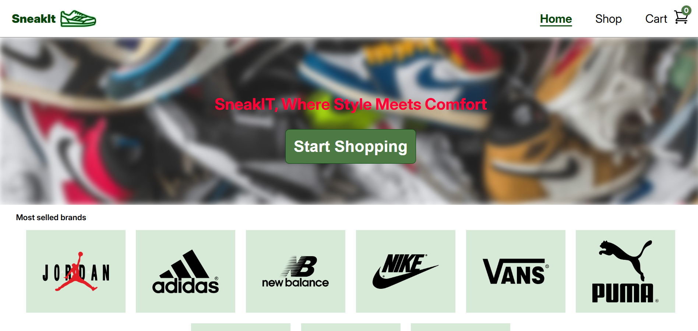
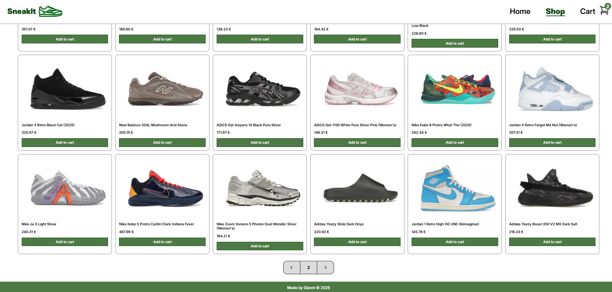
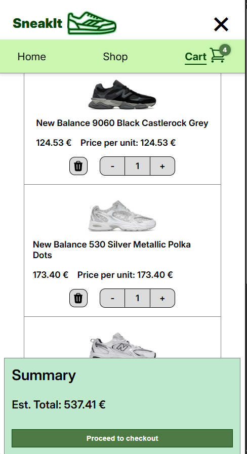

# 🛍️ SneakIt - E-commerce Platform

This is a fully frontend web page that i have made for practising my **React** and **frontend** skills, I'm using for getting all the data of the sneakers an API named  [**KicksDB**](https://kicks.dev/) You can take a look at the website [**here**](https://e-comerce-sneakers.vercel.app/) or watch some 🖼️ screenshots down bellow

## 🖼️ Screenshots

<p align="center">
  <strong>Home</strong><br/>
  
</p>

<p align="center">
  <strong>Products</strong><br/>
  
</p>

<p align="center">
  <strong>Product Detail</strong><br/>
  
</p>

<p align="center">
  <strong>Checkout (Mobile)</strong><br/>
  
</p>

## ✨ Features

- 🛒 **Dynamic Product Listings**: Browse a collection of sneakers with detailed information.
- 🔎 **Brand Filters**: Easily filter sneakers by your favorite brands.
- 360° **Product View**: Explore sneakers from all angles using an interactive slider.
- 📄 **Pagination**: Millions of sneakers available thanks to efficient pagination.
- 📱 **Responsive Design**: Optimized for both desktop and mobile devices.
- ⚡ **State Management**: Efficient state handling for a seamless user experience.
- ♻️ **Reusable Components**: Modular and maintainable React components.

## 🛠️ Technologies Used

- ⚛️ **React**: For building the user interface.
- 🧪 **Vite**: For fast development and optimized builds.
- 🎨 **CSS/SCSS**: For styling and responsive design.
- 📜 **JavaScript (ES6+)**: For interactivity and logic.

## 🔑 API Key Requirement

To make the app fully functional, you need to create an account at [**KicksDB**](https://kicks.dev) and obtain an **API key**.  
Once you have it, add the key to your `.env` file like this:

```env
VITE_KICKS_API_KEY=your_api_key_here
```

## ⚙️ Installation and Setup

1. Clone the repository:
   ```bash
   git clone https://github.com/your-username/sneakers-shop.git
   ```
2. Navigate to the project directory:
   ```bash
   cd sneakers-shop
   ```
3. Install dependencies:
   ```bash
   npm install
   ```
4. Start the development server:
   ```bash
   npm run dev
   ```
5. Open your browser and visit `http://localhost:5173`.
